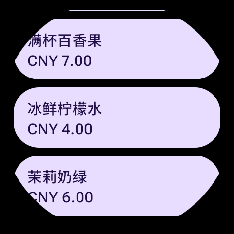
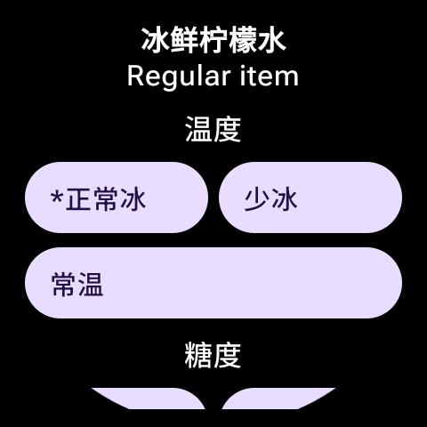

# Wear Mixue

[简体中文](README.zh-CN.md)

Order Mixue from your watch.

Wear Mixue uses Mixue-related APIs to bring the ordering flow to a smartwatch. You can browse menu items, choose product options, place orders with pre-purchased group-buying coupons, and view the pickup code directly on the watch.

This app is designed for lightweight everyday scenarios, especially campus use. For example, high school students can buy a Mixue coupon in Kuaishou Lite ahead of time, place the order from the watch before arriving at the store, and show the pickup code when the drink is ready.

## Disclaimer

> This is an unofficial project for learning and personal use only.
> Any use of this project is at your own risk. The author is not responsible for any loss, account issue, service restriction, legal dispute, or other consequence caused by using this project.

## Features

- Browse Mixue menu items on the watch.
- Choose product options such as temperature and sugar level.
- Log in with authorization data from the Mixue mini program in Kuaishou Lite.
- Place orders after buying Mixue group-buying coupons in advance.
- Display the pickup code after a successful order.
- Use the companion phone app to scan and send login JSON to the watch.

## Before You Start

You need to buy a Mixue group-buying coupon in Kuaishou Lite first. The current login flow depends on authorization data from the Mixue mini program in Kuaishou Lite, so first-time login requires capturing one response JSON from the phone.

Prepare the following:

- A watch with the Wear Mixue watch app installed.
- Optional: a phone with the companion app installed, used to scan and send login JSON to the watch.
- Kuaishou Lite.
- A packet capture app, such as Reqable.

## First-Time Login

1. Open a packet capture app on your phone, such as Reqable, and start capturing traffic.
2. Open Kuaishou Lite and enter the Mixue mini program.
3. Authorize your phone number in the mini program.
4. Go back to the packet capture app and search for `decrypt`.
5. Find this request:

```text
POST https://third-activity.mxbc.net/activity/v1/app/ks/tiny-app/decryptPhoneNum
```

6. Open the request details and view the response body.
7. Copy the full response JSON.
8. Paste the JSON on the watch, or open the companion phone app and scan the watch QR code to send it.
9. Tap "Parse JSON".
10. Tap "Log in".

After login succeeds, you can choose a store, browse products, select options, and place an order with the coupon you already bought.

## Screenshots

| Menu | Product options |
| --- | --- |
|  |  |

### Result

A successful order placed with Wear Mixue — a cup of Snow King Snow Top Coffee:


## License

Wear Mixue is released under the [MIT License](LICENSE).

## Acknowledgements

Thanks to the [LINUX DO](https://linux.do/) community.
